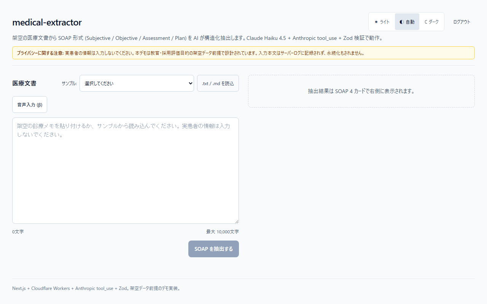
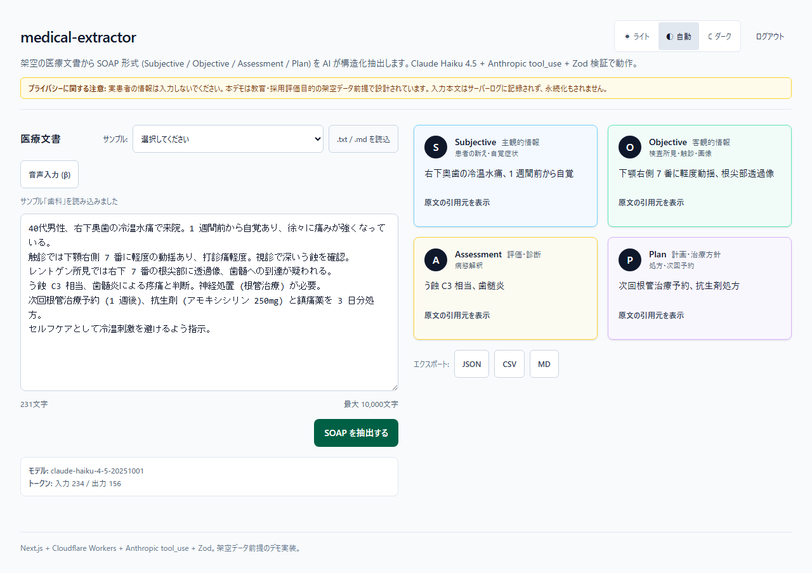
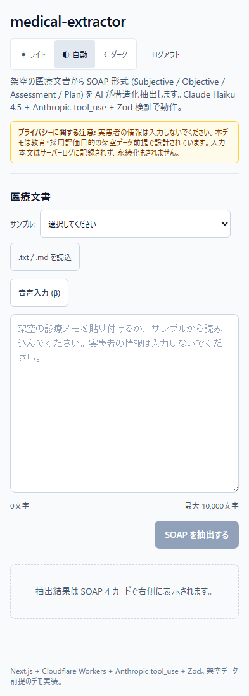
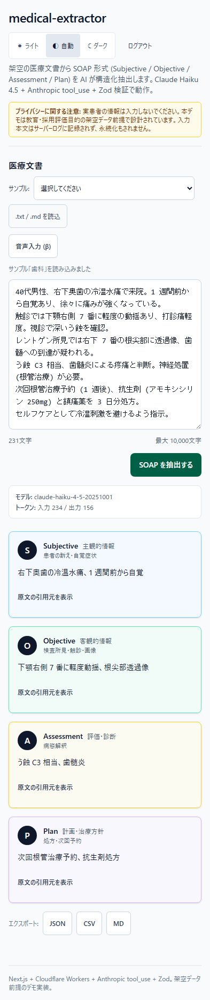

# medical-extractor

> 架空の医療文書から SOAP 形式 (Subjective / Objective / Assessment / Plan) を AI で構造化抽出するデモアプリ。Anthropic Claude tool_use + Zod 二重検証 + Cloudflare Workers エッジ実行。

## Demo

- **Live demo**: https://medical-extractor.atlas-lab.workers.dev (本番稼働中、招待制 — live AI はアクセスキーが必要)
- **Source**: https://github.com/proto-atlas/medical-extractor (GitHub Public)

## Reviewer Quick Path

- **30 秒で見る**: Live demo の認証画面、スクリーンショット、Evidence で公開範囲とSOAP表示例を確認できます。
- **5 分で見る**: [docs/REVIEWER.md](./docs/REVIEWER.md) に、公開デモ範囲、キー保護範囲、主な証跡への導線をまとめています。
- **Evidence**: [docs/evidence/REVIEWER-INDEX.md](./docs/evidence/REVIEWER-INDEX.md) に、README上の主張と証跡ファイルの対応をまとめています。
- **Public scope**: README、スクリーンショット、公開証跡をキーなしで確認できます。
- **Live AI**: 課金・乱用防止のためアクセスキーで保護しています。

### なぜアクセスキー制か

Anthropic API は従量課金のため、無認証で公開すると AI コストの消費攻撃を受ける可能性があります。本デモのアクセスキーはユーザー認証ではなく、公開ポートフォリオの live AI 呼び出しを守る cost guard です。live AI 機能は、アクセスキー（Bearer + constant-time 比較）+ IP/エンドポイント単位のレート制限 + Anthropic Spend Limit の多層防御で守っています。本番 SaaS として運用する場合は、相手別キー、期限付きキー、利用量の相手別追跡を追加する想定です。

### Screenshots

PC viewport (1280×800):

| 認証直後 / プライバシー同意済の空状態 | サンプル「歯科」抽出後の SOAP 4 カード |
|---|---|
|  |  |

SP viewport (393×852, iPhone 15 相当):

| 空状態 | SOAP 4 カード |
|---|---|
|  |  |

スクリーンショットは `npm run screenshots` (= `playwright test --project=screenshots`) で再生成できます。`/api/auth` と `/api/extract` を Playwright `route()` で mock しているため Anthropic API 課金は発生しません。

## Features

- **SOAP 構造化抽出**: Anthropic `tool_use` を `tool_choice: { type: 'tool' }` で強制し、必ず JSON で 4 項目 (S/O/A/P) を返す。各項目に `text` (整理サマリー) と `source_text` (原文引用) を含む
- **二重検証**: Anthropic SDK の `input_schema` (JSON Schema) + サーバー側 Zod `safeParse` の 2 段で AI 出力の構造を担保。スキーマ違反は 502 で再試行を促す
- **3 種のサンプル医療文書**: 一般内科 / 歯科 / 眼科 (すべて完全な架空データ)。ドロップダウンで切替
- **音声入力 (β)**: Web Speech API (Chrome / Edge / Safari)、ja-JP、isFinal=true のみ確定して textarea に追記
- **エクスポート**: JSON / CSV (RFC 4180 準拠) / Markdown の 3 形式、Blob + a[download] でクライアント側のみ完結 (サーバー往復なし)
- **プライバシー設計**: 入力本文をサーバーログに出さない / 抽出結果を永続化しない / 初回モーダル + 常時バナーで利用者に明示
- **コスト保護の多層ゲート**: アクセスキー (Bearer + constant-time 比較) + Cloudflare Workers Rate Limiting binding + Workers Cache API 補助リミッター + dev/test 用 in-memory fallback + Anthropic 側 Spend Limit ($5〜$10/月) を最終防衛
- **ダークモード 3 択**: ライト / 自動 (OS 追従) / ダーク、`localStorage` 記憶 + FOUC 防止
- **セキュリティヘッダ 6 件**: nosniff / X-Frame-Options DENY / Referrer-Policy / Permissions-Policy `microphone=(self)` / HSTS / Content-Security-Policy (`unsafe-inline` 残、nonce 化は将来課題) + `poweredByHeader: false` で `x-powered-by: Next.js` を抑止

## Tech Stack

- Next.js 16.2.4 (App Router, webpack build)
- React 19.2.5
- TypeScript 6.0.3 (strict 最大、`any` 禁止)
- Tailwind CSS 4.2.4 (class 戦略 dark mode via `@custom-variant`)
- `@anthropic-ai/sdk` 0.90.0 (tool_use + tool_choice 強制)
- `zod` 4.3.6 (Zod 4)
- `@opennextjs/cloudflare` 1.19.3 + `wrangler` 4.84.1
- ESLint 10 (flat config) + Prettier 3
- Vitest 4.1.5 (ユニット 137、coverage stmts 94.38 / branches 88.5 / funcs 100 / lines 96.91) + happy-dom + Playwright 1.59 (E2E 19 シナリオ Chromium = auth 4 + privacy 3 + extract 4 + axe a11y 4 + target-size 3 + cross-browser smoke 1、Firefox / WebKit / Mobile は smoke matrix)

## Requirements

- Node.js 24.x LTS
- npm 11+

## Development

```bash
npm install
cp .env.local.example .env.local
# .env.local を編集して ACCESS_PASSWORD と ANTHROPIC_API_KEY を設定
npm run dev
```

開いたタブで:

1. アクセスキー入力 → 認証ゲート通過
2. プライバシー警告モーダルで「理解しました」をクリック (初回のみ)
3. サンプルドロップダウンから 3 種から 1 つ選択 or `.txt` / `.md` / 音声入力で本文を入力
4. 「SOAP を抽出する」をクリック → ~5 秒で 4 カード表示
5. JSON / CSV / MD ボタンで結果をダウンロード

## Scripts

| Command | Description |
|---|---|
| `npm run dev` | ローカル開発サーバ (`next dev`) |
| `npm run build` | 本番ビルド (`next build --webpack`) |
| `npm run typecheck` | TypeScript 型チェック |
| `npm run lint` | ESLint + Prettier |
| `npm run lint:fix` | 自動修正 |
| `npm test` | Vitest ユニットテスト |
| `npm run test:coverage` | カバレッジ付きテスト |
| `npm run e2e` | Playwright E2E (全ブラウザ) |
| `npm run check` | typecheck + lint + test |
| `npm run preview` | OpenNext build + Cloudflare ローカルプレビュー |
| `npm run deploy` | OpenNext build + Cloudflare Workers デプロイ |

## Architecture

詳細は [docs/ARCHITECTURE.md](./docs/ARCHITECTURE.md)。コンポーネント構成・データフロー・ファイル責務を図示しています。

## Design Decisions

各設計判断の背景とトレードオフは [docs/DESIGN-DECISIONS.md](./docs/DESIGN-DECISIONS.md)。10 個前後の主要判断を ADR 形式で記録しています。

## Deployment

Cloudflare Workers 経由で公開します。初回だけ Secrets 設定:

```bash
npx wrangler login
npx wrangler secret put ACCESS_PASSWORD
npx wrangler secret put ANTHROPIC_API_KEY
npm run deploy
```

### Windows 環境の注意

OpenNext は Windows 公式サポート外です。`npm run preview` はローカルで 500 を返す可能性がありますが、本番 Cloudflare Workers は Linux 相当 workerd で動くため影響しません (citation-reader / nuxt-ai-blog で実測確認済み)。ローカル検証は `npm run dev` のみ使用してください。

## Testing

```bash
npm run check # typecheck + lint + Vitest (137)
npm run test:coverage # coverage gate (lines 60 / functions 70 / branches 50 / statements 60)
npx playwright test --project=chromium # E2E Chromium (19 シナリオ: auth/privacy/extract/a11y/target-size/cross-browser smoke)
npm run a11y # axe-core 4 シーン + target-size 3 件のみを抜き出し実行
npm run verify:portfolio # quality gate (typecheck + lint
 # + test:coverage + build + e2e chromium
 # + verify:evidence)
npm run verify:release # release 前ゲート (Lighthouse / live eval /
 # audit freshness / production smoke の不足を機械検出して fail)
```

E2E は `playwright.config.ts` の `webServer.env` に E2E 専用 `ACCESS_PASSWORD` を注入する設計で、`.env.local` の値には依存しません。`/api/extract` は `page.route()` でモックして AI への課金を発生させません。

`/api/auth` と `/api/extract` の route 単体テストは `src/app/api/*/route.test.ts` にあり、Anthropic SDK は class mock で stub 化しています (実 API 課金ゼロ)。

## Quality / Evidence

第三者確認向けの自動検査と証跡を `docs/evidence/` に集約しています ([`docs/evidence/REVIEWER-INDEX.md`](./docs/evidence/REVIEWER-INDEX.md) が公開向け index)。

| 項目 | コマンド | 結果 / Evidence |
|---|---|---|
| 静的解析 + ユニット + coverage gate + build | `npm run check` / `npm run test:coverage` / `npm run build` | typecheck pass / lint pass / Vitest 15 files 137 件 / stmts 94.38 branches 88.5 funcs 100 lines 96.91 / build pass |
| Chromium E2E (auth / privacy / extract / a11y / target-size / cross-browser smoke 19 件) | `npm run e2e -- --project=chromium` | 全 pass |
| axe-core 4 シーン (login / dialog / 空状態 / SOAP 結果) | `npm run a11y` | critical / serious 0 ([`a11y-2026-04-27.md`](./docs/evidence/a11y-2026-04-27.md)) |
| target-size (WCAG AA 24px / AAA 44px) | (a11y に含む) | 主要操作 button AAA pass、全 visible interactive 要素 (button + a + input + select + textarea + [role=*]) AA pass |
| `npm audit --audit-level=high` | `npm audit --audit-level=high --json` | 0 high / 0 critical / 6 moderate、package-lock SHA-256 記録済み ([`dependency-audit-2026-04-29.md`](./docs/evidence/dependency-audit-2026-04-29.md), raw JSON は [`npm-audit-2026-04-29.json`](./docs/evidence/npm-audit-2026-04-29.json)) |
| SOAP eval (構造正確性 + medical-domain mention) | `RUN_LIVE_ANTHROPIC=1 npm run eval:soap -- --limit=1` | 架空fixture 1件で live 20/20 checks pass ([`soap-eval-2026-04-28.md`](./docs/evidence/soap-eval-2026-04-28.md)) |
| Lighthouse | Lighthouse 13.0.1 + Edge headless | desktop 100 / 95 / 100 / 100、mobile 89 / 95 / 100 / 100 ([`lighthouse-2026-04-28.md`](./docs/evidence/lighthouse-2026-04-28.md)。過去の取得失敗経緯は [`lighthouse-2026-04-27.md`](./docs/evidence/lighthouse-2026-04-27.md)) |
| Production smoke | `PRODUCTION_URL=https://medical-extractor.atlas-lab.workers.dev npm run smoke:production` | `/`, `/icon.svg`, `/opengraph-image.svg`, `/_not-found`, `/api/auth`, `/api/extract` 全 pass ([`production-smoke-2026-04-28.md`](./docs/evidence/production-smoke-2026-04-28.md)) |
| medical-domain evidence (FHIR R5 / ICD-10 / HIPAA / 匿名加工情報) | (docs 参照) | [`docs/medical-domain-evidence.md`](./docs/medical-domain-evidence.md) で標準への参照と実装範囲外の境界を明示 |
| Quality gate | `npm run verify:portfolio` | typecheck + lint + test:coverage + build + e2e + verify:evidence を直列実行 |
| Release 前ゲート | `npm run verify:release` | pass ([`release-baseline-2026-04-29.md`](./docs/evidence/release-baseline-2026-04-29.md)) |

CI (`.github/workflows/ci.yml`) でも quality-gate ジョブが上記の主要項目 + secret scan + `npm run verify:evidence` (証跡存在検査) を強制します。

## Eval

`eval/soap-fixtures/` に **架空** の医療文書 fixture 3 件 (internal / dental / ophthalmology) を保管しています。`npm run eval:soap` で SOAP 抽出の構造的正確性を機械評価できます。

```bash
npm run eval:soap # dry-run (実 API 送信なし、fixture と評価項目のみ表示)
RUN_LIVE_ANTHROPIC=1 ANTHROPIC_API_KEY=sk-... npm run eval:soap
 # 実 API で 1 件評価 (デフォルト)
RUN_LIVE_ANTHROPIC=1 ANTHROPIC_API_KEY=sk-... npm run eval:soap -- --limit=3
 # 最大 3 件 (clamp 1〜3、コスト保護)
```

評価項目: subjective / objective / assessment / plan の 4 項目存在 + 各 text・source_text 非空 + source_text の原文 (documentText) 部分一致 + 期待キーワード含有。source_text 照合では、原文の改行差分だけを空白正規化します。schema 違反は Anthropic SDK の `strict: true` + `additionalProperties: false` で API 層が弾きます。

**送信するデータは架空のみです** (実患者情報を一切含まない、`src/lib/samples.ts` のサンプル文書ベース)。最新の実行結果は [`docs/evidence/soap-eval-2026-04-28.md`](./docs/evidence/soap-eval-2026-04-28.md)。

## Dependencies and Known Constraints

### npm audit (moderate 残)

`npm audit --audit-level=high` を CI quality-gate でブロッキング実行しています (2026-04-29 ローカル実行で 0 high / 0 critical を確認)。一方で moderate レベルは Next.js / OpenNext の transitive 由来でアップストリーム修正待ちのため、意図的に許容しています。

- `postcss <8.5.10` ([GHSA-qx2v-qp2m-jg93](https://github.com/advisories/GHSA-qx2v-qp2m-jg93)): Next 16 が内部 lock している `postcss` が古い。本リポの直接 `postcss` は `^8.5.10` (修正版) で問題なし。次回 Next リリースで解消見込み
- `fast-xml-parser <5.7.0` ([GHSA-gh4j-gqv2-49f6](https://github.com/advisories/GHSA-gh4j-gqv2-49f6)): OpenNext が依存する AWS SDK 経由。本リポはランタイムで XML を出力しないため発火経路なし

再計測結果は [`docs/evidence/dependency-audit-2026-04-28.md`](./docs/evidence/dependency-audit-2026-04-28.md)、経路詳細とリスク評価は [`docs/evidence/dependency-audit-2026-04-27.md`](./docs/evidence/dependency-audit-2026-04-27.md) を参照。

### Cloudflare Workers のレート制限

本番では Cloudflare Workers Rate Limiting binding を `auth` / `extract-auth` / `extract` の3 scopeに分けて使い、Workers Cache API の補助リミッターを重ねています。ローカル dev / unit test では binding / Cache API が存在しないため、同じ閾値の in-memory fallback に切り替わります。Rate Limiting binding は abuse reduction 用であり、会計グレードの完全なグローバル上限ではないため、招待制アクセスキーと Anthropic Spend Limit も併用する方針です (詳細は [docs/DESIGN-DECISIONS.md](./docs/DESIGN-DECISIONS.md))。

### Web Speech API のクラウド送信

音声入力 (`VoiceInputButton`) はブラウザ標準 Web Speech API を使用しており、音声データは Apple / Google 等のクラウドに送信される場合があります。プライバシー警告モーダル (`PrivacyDialog`) で利用者に明示しています。

## Privacy

本デモは **教育・公開デモ目的の架空データ前提**で設計されています。実患者の医療情報を入力しないでください。詳細は [docs/DESIGN-DECISIONS.md](./docs/DESIGN-DECISIONS.md) のプライバシー設計セクションを参照。

## License

MIT
