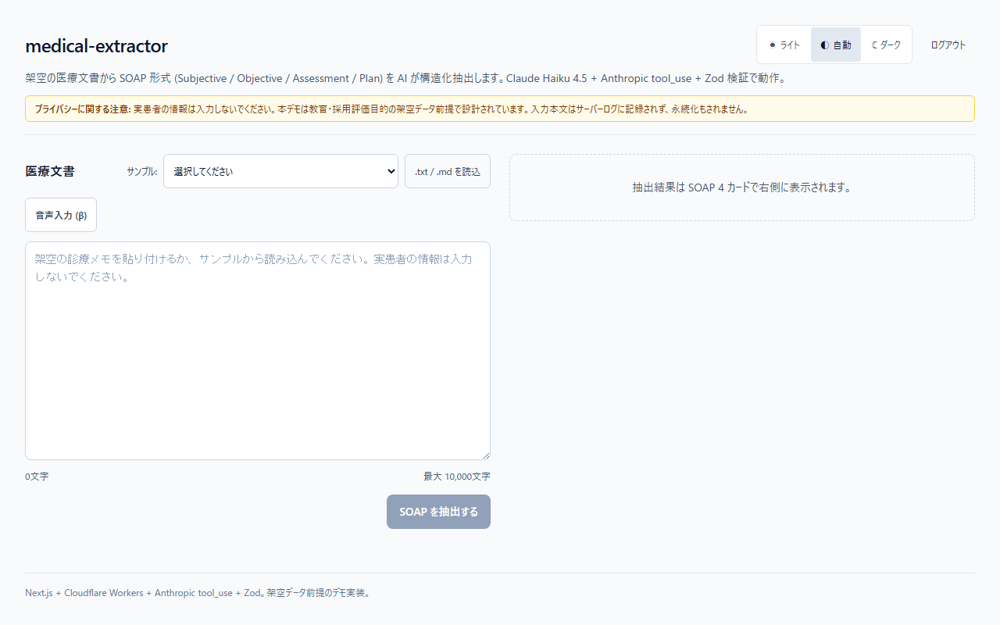
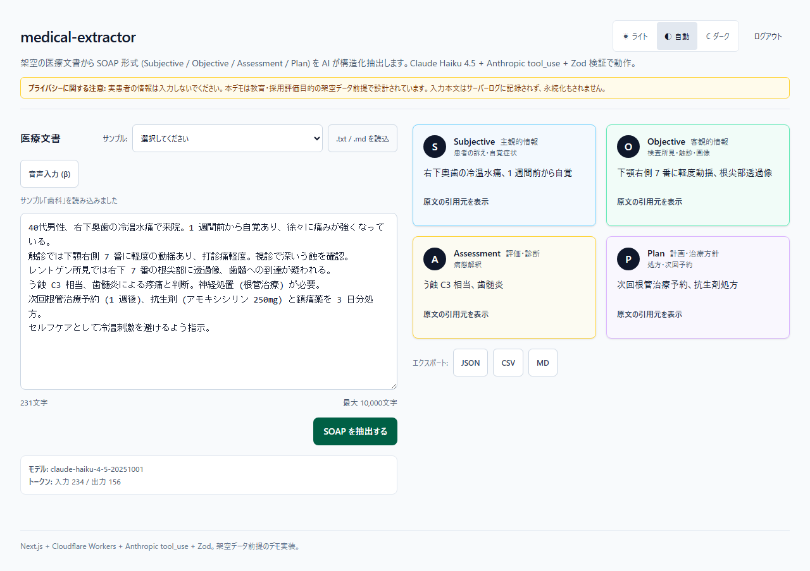
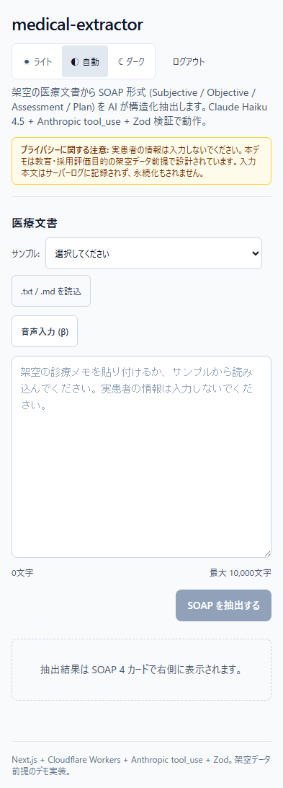
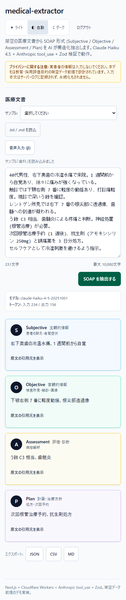

# medical-extractor

> 架空の医療文書からSOAP形式 (Subjective / Objective / Assessment / Plan) をAIで構造化抽出するデモアプリです。Anthropic Claude tool_use、Zod二重検証、Cloudflare Workersで動かしています。

## デモ

- **公開URL**: https://medical-extractor.atlas-lab.workers.dev (本番稼働中、招待制: 実APIはアクセスキーが必要)
- **GitHub**: https://github.com/proto-atlas/medical-extractor (GitHub Public)

## 確認の流れ

- **30 秒で見る**: 公開URLの認証画面、スクリーンショット、検証記録で公開範囲とSOAP表示例を確認できます。
- **5 分で見る**: [docs/verification.md](./docs/verification.md) に、公開URLで確認できる範囲、キー保護範囲、主な証跡への導線をまとめています。
- **検証記録**: [docs/evidence/INDEX.md](./docs/evidence/INDEX.md) に、README上の主張と証跡ファイルの対応をまとめています。
- **公開範囲**: README、スクリーンショット、公開証跡をキーなしで確認できます。
- **実API**: 課金・乱用防止のためアクセスキーで保護しています。

### なぜアクセスキー制か

Anthropic APIは従量課金のため、無認証で公開するとAIコストを意図せず消費する可能性があります。このアプリのアクセスキーはユーザー認証ではなく、公開URLの実API呼び出しの利用量を抑えるためのものです。実API機能は、アクセスキー（Bearer + constant-time比較）、IPとエンドポイント単位のレート制限、Anthropic Spend Limitを併用しています。ユーザー登録を含む運用にする場合は、相手別キー、期限付きキー、利用量の相手別追跡を追加する想定です。

### 画面

PC viewport (1280×800):

| 認証直後 / プライバシー同意済の空状態 | サンプル「歯科」抽出後のSOAP 4 カード |
|---|---|
|  |  |

SP viewport (393×852, iPhone 15 相当):

| 空状態 | SOAP 4 カード |
|---|---|
|  |  |

スクリーンショットは `npm run screenshots` (= `playwright test --project=screenshots`) で再生成できます。`/api/auth` と `/api/extract` をPlaywright `route()` で応答置き換えしているためAnthropic API課金は発生しません。

## 主な機能

- **SOAP構造化抽出**: Anthropic `tool_use` を `tool_choice: { type: 'tool' }` で強制し、JSONで 4 項目 (S/O/A/P) を返させ、返らない場合は 502 で再試行を促す。各項目に `text` (整理サマリー) と `source_text` (原文引用) を含む
- **二重検証**: Anthropic SDKの `input_schema` (JSON Schema) + サーバー側Zod `safeParse` の 2 段でAI出力の構造を担保。スキーマ違反は 502 で再試行を促す
- **3 種のサンプル医療文書**: 一般内科 / 歯科 / 眼科 (すべて完全な架空データ)。ドロップダウンで切替
- **音声入力 (β)**: Web Speech API (Chrome / Edge / Safari)、ja-JP、isFinal=trueのみ確定してtextareaに追記
- **エクスポート**: JSON / CSV (RFC 4180 準拠) / Markdownの 3 形式、Blob + a[download] でクライアント側のみ完結 (サーバー往復なし)
- **プライバシー設計**: 入力本文をサーバーログに出さない / 抽出結果を永続化しない / 初回モーダル + 常時バナーで利用者に明示
- **コスト保護**: アクセスキー (Bearer + constant-time比較) + Cloudflare Workers Rate Limiting binding + Workers Cache API補助リミッター + 開発時・テスト時のメモリ上の代替処理 + Anthropic側Spend Limit ($5〜$10/月) を併用
- **ダークモード 3 択**: ライト / 自動 (OS追従) / ダーク、`localStorage` 記憶 + FOUC防止
- **セキュリティヘッダ 6 件**: nosniff / X-Frame-Options DENY / Referrer-Policy / Permissions-Policy `microphone=(self)` / HSTS / Content-Security-Policy (`unsafe-inline` 残、nonce化は将来課題) + `poweredByHeader: false` で `x-powered-by: Next.js` を抑止

## 使用技術

- Next.js 16.2.6 (App Router, webpack build)
- React 19.2.6
- TypeScript 6.0.3 (strict最大、`any` 禁止)
- Tailwind CSS 4.2.4 (class戦略dark mode via `@custom-variant`)
- `@anthropic-ai/sdk` 0.96.0 (tool_use + tool_choice強制)
- `zod` 4.3.6 (Zod 4)
- `@opennextjs/cloudflare` 1.19.8 + `wrangler` 4.97.0
- ESLint 10 (flat config) + Prettier 3
- Vitest 4.1.5 (ユニット 137、coverage stmts 94.38 / branches 88.5 / funcs 100 / lines 96.91) + happy-dom + Playwright 1.59 (E2E 19 シナリオChromium = auth 4 + privacy 3 + extract 4 + axe a11y 4 + target-size 3 + cross-browser疎通確認 1、Firefox / WebKit / Mobileはbrowser matrix)

## 必要環境

- Node.js 24.x LTS
- npm 11+

## 開発

```bash
npm install
cp .env.local.example .env.local
# .env.localを編集してACCESS_PASSWORDとANTHROPIC_API_KEYを設定
npm run dev
```

開いたタブで:

1. アクセスキー入力 → 認証を通過
2. プライバシー警告モーダルで「理解しました」をクリック (初回のみ)
3. サンプルドロップダウンから 3 種から 1 つ選択or `.txt` / `.md` / 音声入力で本文を入力
4. 「SOAPを抽出する」をクリック → ~5 秒で 4 カード表示
5. JSON / CSV / MDボタンで結果をダウンロード

## コマンド

| コマンド | 内容 |
|---|---|
| `npm run dev` | ローカル開発サーバ (`next dev`) |
| `npm run build` | 本番ビルド (`next build --webpack`) |
| `npm run typecheck` | TypeScript型チェック |
| `npm run lint` | ESLint + Prettier |
| `npm run lint:fix` | 自動修正 |
| `npm test` | Vitestユニットテスト |
| `npm run test:coverage` | カバレッジ付きテスト |
| `npm run e2e` | Playwright E2E (全ブラウザ) |
| `npm run check` | typecheck + lint + test |
| `npm run preview` | OpenNext build + Cloudflareローカルプレビュー |
| `npm run deploy` | OpenNext build + Cloudflare Workersデプロイ |

## アーキテクチャ

詳細は [docs/ARCHITECTURE.md](./docs/ARCHITECTURE.md)。コンポーネント構成・データフロー・ファイル責務を図示しています。

## 設計判断

各設計判断の背景とトレードオフは [docs/DESIGN-DECISIONS.md](./docs/DESIGN-DECISIONS.md)。10 個前後の主要判断をADR形式で記録しています。

## デプロイ

Cloudflare Workers経由で公開します。初回だけSecrets設定:

```bash
npx wrangler login
npx wrangler secret put ACCESS_PASSWORD
npx wrangler secret put ANTHROPIC_API_KEY
npm run deploy
```

### Windows環境の注意

OpenNextはWindows公式サポート外です。`npm run preview` はローカルで 500 を返す可能性がありますが、本番Cloudflare WorkersはLinux相当workerdで動くため影響しません (citation-reader / nuxt-ai-blogで実測確認済み)。ローカル検証は `npm run dev` のみ使用してください。

## テスト

```bash
npm run check # typecheck + lint + Vitest (137)
npm run test:coverage # coverage閾値 (lines 60 / functions 70 / branches 50 / statements 60)
npx playwright test --project=chromium # E2E Chromium (19 シナリオ: auth/privacy/extract/a11y/target-size/cross-browser疎通確認)
npm run a11y # axe-core 4 シーン + target-size 3 件のみを抜き出し実行
npm run verify:quality # 品質確認 (typecheck + lint
 # + test:coverage + build + e2e chromium
 # + verify:evidence)
npm run verify:release # release確認 (Lighthouse / 実API評価 /
 # audit freshness / 公開URL確認 の不足を機械検出してfail)
```

E2Eは `playwright.config.ts` の `webServer.env` にE2E専用 `ACCESS_PASSWORD` を注入する設計で、`.env.local` の値には依存しません。`/api/extract` は `page.route()` でモックしてAIへの課金を発生させません。

`/api/auth` と `/api/extract` のroute単体テストは `src/app/api/*/route.test.ts` にあり、Anthropic SDKの呼び出しはテスト用実装に置き換えています (実API課金ゼロ)。

## 品質確認と検証記録

確認時に使える自動検査と証跡を `docs/evidence/` に集約しています ([`docs/evidence/INDEX.md`](./docs/evidence/INDEX.md) が公開向けindex)。

| 項目 | コマンド | 結果 / 検証記録 |
|---|---|---|
| 静的解析 + ユニット + coverage閾値 + build | `npm run check` / `npm run test:coverage` / `npm run build` | typecheck通過 / lint通過 / Vitest 15 files 137 件 / stmts 94.38 branches 88.5 funcs 100 lines 96.91 / build通過 |
| Chromium E2E (auth / privacy / extract / a11y / target-size / cross-browser疎通確認 19 件) | `npm run e2e -- --project=chromium` | すべて通過 |
| axe-core 4 シーン (login / dialog / 空状態 / SOAP結果) | `npm run a11y` | critical / serious 0 ([`a11y-2026-04-27.md`](./docs/evidence/a11y-2026-04-27.md)) |
| target-size (WCAG AA 24px / AAA 44px) | (a11yに含む) | 主要操作button AAA通過、全visible interactive要素 (button + a + input + select + textarea + [role=*]) AA通過 |
| `npm audit --audit-level=high` | `npm audit --audit-level=high --json` | 0 vulnerabilities、package-lock SHA-256 記録済み ([`dependency-audit-2026-06-04.md`](./docs/evidence/dependency-audit-2026-06-04.md), JSONは [`npm-audit-2026-06-04.json`](./docs/evidence/npm-audit-2026-06-04.json)) |
| SOAP eval (構造正確性 + medical-domain mention) | `RUN_LIVE_ANTHROPIC=1 npm run eval:soap -- --limit=1` | 架空fixture 1件で20/20項目を確認 ([`soap-eval-2026-04-28.md`](./docs/evidence/soap-eval-2026-04-28.md)) |
| Lighthouse | Lighthouse 13.0.1 + Edge headless | desktop 100 / 95 / 100 / 100、mobile 89 / 95 / 100 / 100 ([`lighthouse-2026-04-28.md`](./docs/evidence/lighthouse-2026-04-28.md)。過去の取得失敗経緯は [`lighthouse-2026-04-27.md`](./docs/evidence/lighthouse-2026-04-27.md)) |
| 公開URL確認 | `PRODUCTION_URL=https://medical-extractor.atlas-lab.workers.dev npm run check:production` | `/`, `/icon.svg`, `/opengraph-image.svg`, `/_not-found`, `/api/auth`, `/api/extract` すべて通過 ([`production-check-2026-04-28.md`](./docs/evidence/production-check-2026-04-28.md)) |
| medical-domain evidence (FHIR R5 / ICD-10 / HIPAA / 匿名加工情報) | (docs参照) | [`docs/medical-domain-evidence.md`](./docs/medical-domain-evidence.md) で標準への参照と実装範囲外の境界を明示 |
| 品質確認 | `npm run verify:quality` | typecheck + lint + test:coverage + build + e2e + verify:evidenceを直列実行 |
| release確認 | `npm run verify:release` | 通過 ([`release-baseline-2026-04-29.md`](./docs/evidence/release-baseline-2026-04-29.md)) |

CI (`.github/workflows/ci.yml`) でもquality-checkジョブが上記の主要項目 + secret scan + `npm run verify:evidence` (証跡存在検査) を強制します。

## 評価

`eval/soap-fixtures/` に **架空** の医療文書fixture 3 件 (internal / dental / ophthalmology) を保管しています。`npm run eval:soap` でSOAP抽出の構造的正確性を機械評価できます。

```bash
npm run eval:soap # dry-run (実API送信なし、fixtureと評価項目のみ表示)
RUN_LIVE_ANTHROPIC=1 ANTHROPIC_API_KEY=sk-... npm run eval:soap
 # 実APIで 1 件評価 (デフォルト)
RUN_LIVE_ANTHROPIC=1 ANTHROPIC_API_KEY=sk-... npm run eval:soap -- --limit=3
 # 最大 3 件 (clamp 1〜3、コスト保護)
```

評価項目: subjective / objective / assessment / planの 4 項目存在 + 各text・source_text非空 + source_textの原文 (documentText) 部分一致 + 期待キーワード含有。source_text照合では、原文の改行差分だけを空白正規化します。schema違反はAnthropic SDKの `strict: true` + `additionalProperties: false` でAPI層が弾きます。

**送信するデータは架空のみです** (実患者情報を一切含まない、`src/lib/samples.ts` のサンプル文書ベース)。最新の実行結果は [`docs/evidence/soap-eval-2026-04-28.md`](./docs/evidence/soap-eval-2026-04-28.md)。

## 依存関係と制約

### npm auditの扱い

2026-06-04 時点の `npm audit --audit-level=high --json` はexit 0、0 vulnerabilitiesです。結果は [`docs/evidence/dependency-audit-2026-06-04.md`](./docs/evidence/dependency-audit-2026-06-04.md) と [`docs/evidence/npm-audit-2026-06-04.json`](./docs/evidence/npm-audit-2026-06-04.json) に記録しています。

2026-04-27 から 2026-04-29 の依存監査記録は、当時残っていた `moderate` advisoryの扱いを残す履歴です。現在のlockfileでは `npm audit fix` により解消済みです。

### Cloudflare Workersのレート制限

本番ではCloudflare Workers Rate Limiting bindingを `auth`、`extract-auth`、`extract` の 3 scopeに分けて使い、Workers Cache APIの補助リミッターを重ねています。ローカルdevとunit testではbindingやCache APIが存在しないため、同じ閾値をメモリ上で再現します。Rate Limiting bindingは大量送信を減らすための仕組みであり、完全な利用量管理ではないため、招待制アクセスキーとAnthropic Spend Limitも併用する方針です (詳細は [docs/DESIGN-DECISIONS.md](./docs/DESIGN-DECISIONS.md))。

### Web Speech APIのクラウド送信

音声入力 (`VoiceInputButton`) はブラウザ標準Web Speech APIを使用しており、音声データはApple / Google等のクラウドに送信される場合があります。プライバシー警告モーダル (`PrivacyDialog`) で利用者に明示しています。

## プライバシー

このアプリは **学習目的の架空データだけを扱う設計**です。実患者の医療情報を入力しないでください。詳細は [docs/DESIGN-DECISIONS.md](./docs/DESIGN-DECISIONS.md) のプライバシー設計セクションを参照。

## ライセンス

MIT
